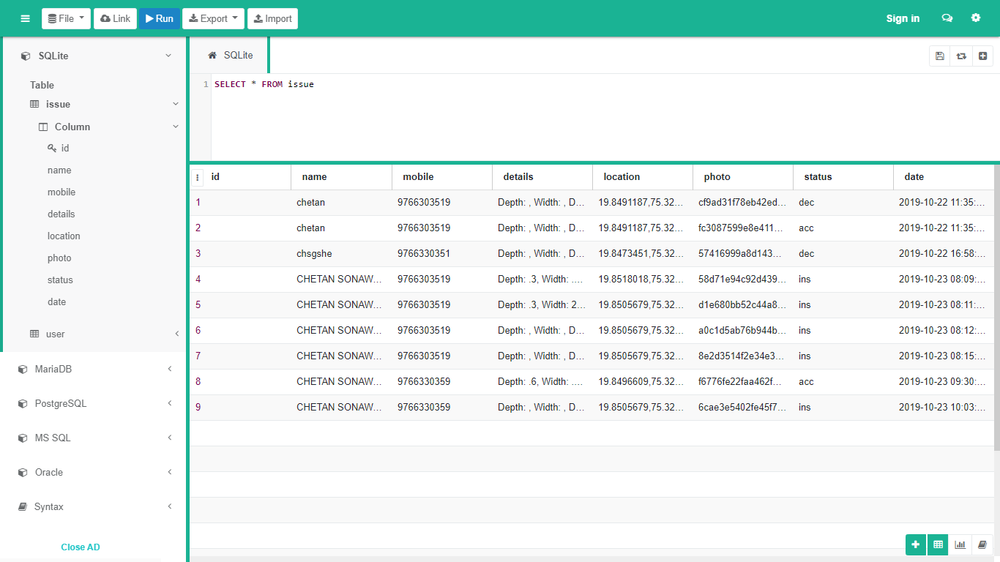

# Road Defect Detection Server

**Note: You can also read PDF also**

Backend app written with Python(>=3.8) and Flask for RDD android client app.

This project includes all the required python code to deploy server to any platform of your choice.

This Server has admin panel for viewing and verification of submitted data from android app. With APIs for submitting and fetching data.

## Introduction

As when Roads are constructed government delegates this task top private constructors. After the construction roads need to be maintained and here comes the role of Road Inspection officer and Road Maintenance agency. Road Inspection officer are responsible for keeping eyes on the maintenance required for the road. Usually a citizen submits a report if he/she sees a road where maintenance is required. After that RoadInspection Officer reviews that report and if it requires maintenance then forwards that report to the Road Maintenance Agency, Which then  takes charge of this process and start working on the maintenance of the road.The problems with this approach are that not every citizen is eager to make descriptive report with location and photos with it and finding how to submit a report to whom to submit. After that user may did not provide all the information and manual inspection may be needed on that case. There are plenty of problems with this approach and as issues grows maintenance required for the road also grows and in that situation following this lengthy process may become cumbersome for everyone in this cycle.Road Defect Management overcomes this all issues with providing digital solution to all. Citizens have an android app which they can create their profile and submit report for maintenance. That report will be sent directly to the Road Inspection officer which then he can review, as app makes it compulsory and easy to click the photos and submit them, RoadInspection Officer will always have better reference and description of the issue. Road Inspection Officer have an online dashboard which they can login into and review all the reports. They can decide whether to forward this issue to Road Maintenance Agency or decline it. If it’s declined then issue would still be saved for documentation purposes. If it’s forwarded then now Road Maintenance Agency can see the report and all the data with it and start working on it. In this entire process all the submitted data is saved and citizen who reported the issue can always track the status of the report.

### Tech Stack:
- Python 3
- Flask and SQLAlchemy
- HTML and JS

## Screenshots:
### Login 

### Admin Page

### Validating submitted data

### Database

## Please checkout the Client App for android too:
 - [Road Defect Detection Client GitHub](https://github.com/kubre/RDD-Client)